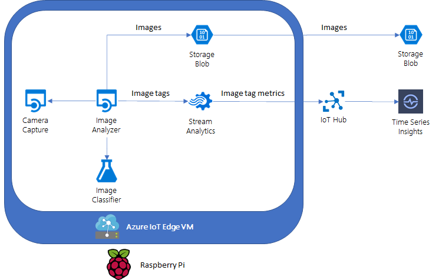

# Video Analytics on IoT Edge
Playground for custom and live video capabilities with Azure IoT Edge on a Raspberry Pi 4


Recently I bought a new Raspberry Pi 4 with a camera module and decided to play with some video capabilities to run at the edge. My goal was to capture images using the Pi's camera module, analyze them in real-time and report metrics based on images' metadata  up to IoT Hub. The architecture would then look something like the image below:





## Pre-requisites

In order to successfully deploy this solution, you will need a couple of things first:

- [Azure CLI](https://docs.microsoft.com/en-us/cli/azure/install-azure-cli?view=azure-cli-latest).
- [Azure IoT CLI Extension](https://github.com/Azure/azure-iot-cli-extension).
- (Optional) [Docker Desktop](https://docs.docker.com/docker-for-windows/install/). You will need it if you decide to build images yourself.
- A Raspberry Pi with a camera module. Review this [checklist](https://blog.jongallant.com/2017/11/raspberrypi-setup/) to make sure your device is setup and ready. **NOTE:** The instructions in the link point to Raspberry Pi 3, but they also work with Pi 4 modules.
- An Azure account with an active subscription. [Create one for free](https://azure.microsoft.com/free/?ref=microsoft.com&utm_source=microsoft.com&utm_medium=docs&utm_campaign=visualstudio).
- A standard [IoT hub](https://docs.microsoft.com/en-us/azure/iot-hub/iot-hub-create-through-portal?view=iotedge-2018-06) in your Azure subscription.
- A [registered IoT Edge device](https://docs.microsoft.com/en-us/azure/iot-edge/how-to-register-device?view=iotedge-2018-06&tabs=azure-portal) in your IoT Hub.
- [Install Azure IoT Edge](https://docs.microsoft.com/en-us/azure/iot-edge/how-to-install-iot-edge?view=iotedge-2018-06) on your Raspberry Pi.


> [!NOTE]: This project is designed to work on a Raspberry Pi device, but it can be extended to work on other architectures as long as they have access to a camera. In that case you will probably have to customize the Camera Capture module to match your resources.

 

## Get the code

First, clone the repository:

```
git clone https://github.com/marvin-garcia/video-iot-edge.git
cd video-iot-edge/
```


## Deploy the solution

In order to create a deployment on an IoT edge device, you need a target condition that matches your device's device twin. For example, the code snippet below uses the [az iot hub device-twin](https://docs.microsoft.com/en-us/cli/azure/ext/azure-iot/iot/hub/device-twin?view=azure-cli-latest#ext_azure_iot_az_iot_hub_device_twin_update) command to mark your IoT Edge device as video capable:

```powershell
az iot hub device-twin update -n {iothub_name} -d {device_id} --tags '{ "edgeVideo": true }'
```


Assuming you tagged your IoT Edge device with the command above, use the [az iot edge deployment](https://docs.microsoft.com/en-us/cli/azure/ext/azure-iot/iot/edge/deployment?view=azure-cli-latest#ext_azure_iot_az_iot_edge_deployment_create) command to create a deployment on your IoT Edge device:

```powershell
az iot edge deployment create -g {resource_group_name} --hub-name {iothub_name} -d {deployment_name} --tc "tags.edgeVideo=true" -k config/deployment.json
```


After a few minutes you should see data flowing through your IoT Hub:

```json
{
  "body": {
    "tags": [
      {
        "name": "person",
        "confidence": 0.9997624754905701
      },
      {
        "name": "indoor",
        "confidence": 0.9947509765625
      },
      {
        "name": "wall",
        "confidence": 0.9840184450149536
      },
      {
        "name": "man",
        "confidence": 0.9779672622680664
      },
      {
        "name": "headphones",
        "confidence": 0.9511679410934448
      },
      {
        "name": "human face",
        "confidence": 0.89225172996521
      }
    ]
  },
  "enqueuedTime": "2021-02-19T19:54:38.480Z",
  "properties": {}
}
```


## Explore the code

Now that you saw it in action, let's dive deeper into the architecture and each module.

- [Camera Capture](VideoEdgeSolution/modules/CameraCapture/README.md)
- [Image Analyzer](VideoEdgeSolution/modules/ImageAnalyzer/README.md)